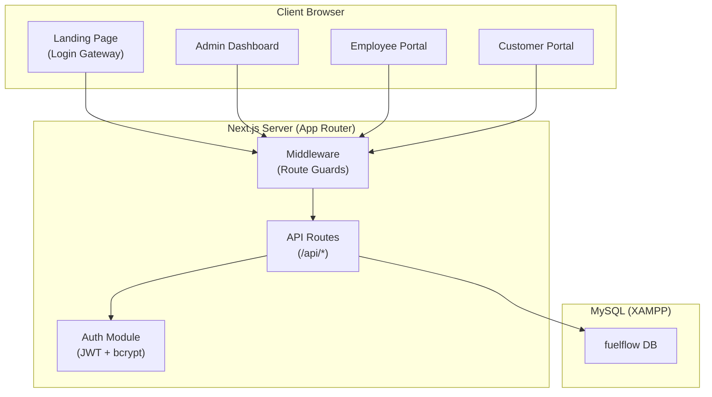
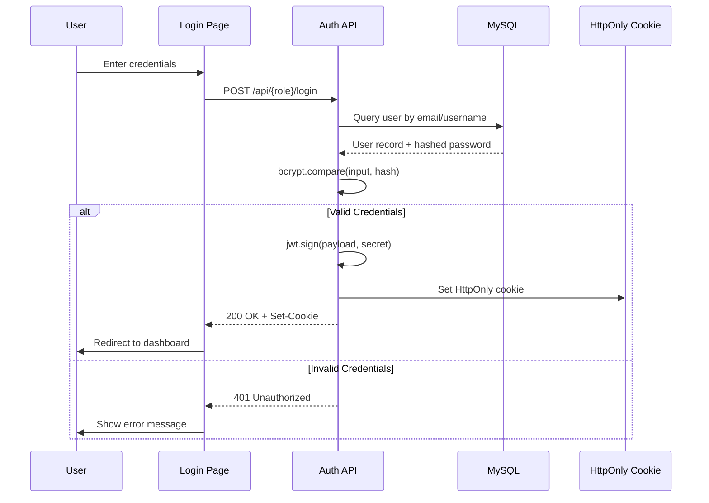
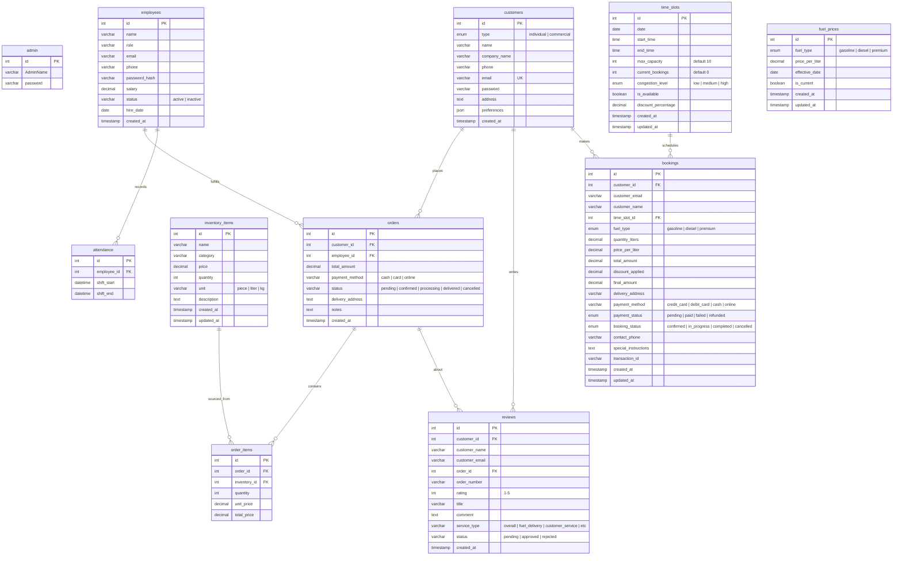
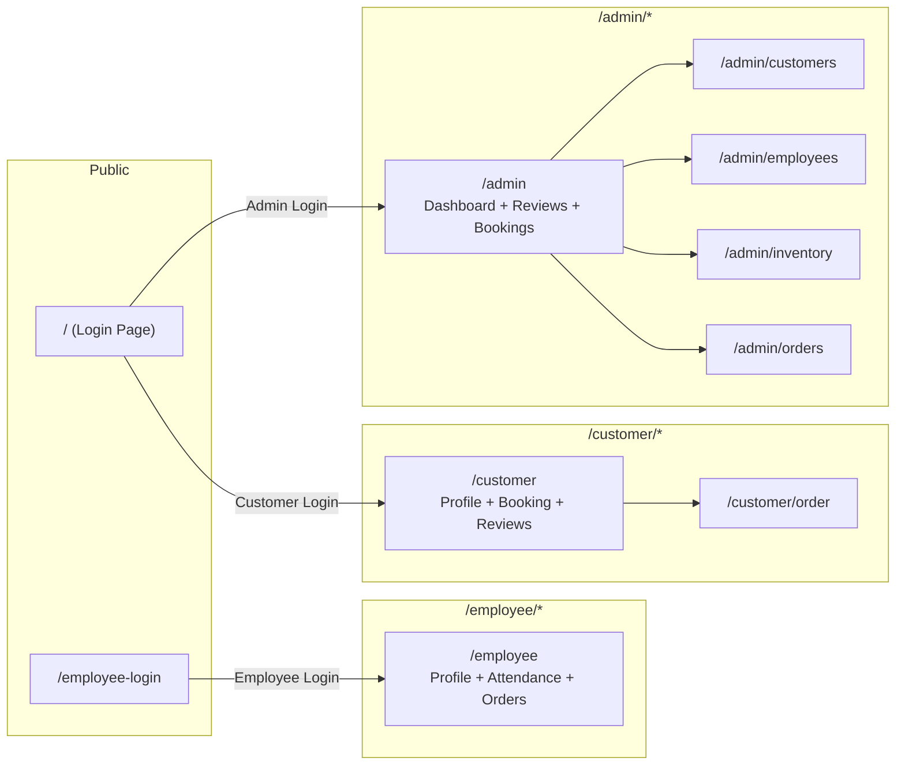

# 📋 Software Requirements Specification (SRS)
## **FuelFlow — Gas Station & Fuel Dispatch Management System**

| Field | Value |
|---|---|
| **Project Name** | FuelFlow |
| **Version** | 0.1.0 |
| **Document Date** | September 10, 2026 |
| **Repository** | `g:\FuelFlow` |
| **Status** | Active Development |

---

## 1. Introduction

### 1.1 Purpose
FuelFlow is a **full-stack web application** for managing gas station operations, fuel dispatch, and delivery services. It provides a unified platform for **administrators**, **employees (staff)**, and **customers** to interact with the gas station's core business processes — including inventory management, order fulfillment, shift attendance, booking scheduling, reviews, and analytics reporting.

### 1.2 Scope
The system covers the entire operational lifecycle of a fuel distribution business:

- **Admin Console** — Full operational control, analytics dashboard, employee/customer/inventory management, order tracking, reviews moderation, and booking management.
- **Employee Portal** — Shift registration (check-in/out), personal profile, and assigned order management with status updates.
- **Customer Portal** — Self-service dashboard for placing fuel orders, smart booking with time-slot selection, booking history, and submitting service reviews.
- **Public Landing Page** — A unified login gateway supporting Admin, Employee, and Customer authentication.

### 1.3 Technology Stack

| Layer | Technology |
|---|---|
| **Framework** | [Next.js 15.5.0](file:///g:/FuelFlow/package.json) (App Router, Turbopack) |
| **Language** | TypeScript 5.x |
| **Frontend** | React 19.1.0, Tailwind CSS 4.x |
| **Backend** | Next.js API Routes (Server-side) |
| **Database** | MySQL (via XAMPP, `mysql2/promise`) |
| **Auth** | JWT (`jsonwebtoken`) + bcrypt (`bcryptjs`) |
| **Fonts** | Geist Sans, Geist Mono, Outfit (Google Fonts via `next/font`) |
| **Styling** | Tailwind CSS 4 with custom design system (glassmorphism, gradients, animations) |
| **Dev Server** | `next dev --turbopack` |

### 1.4 Environment Configuration

Defined in [`.env.local`](file:///g:/FuelFlow/.env.local):

| Variable | Purpose |
|---|---|
| `DB_HOST` | MySQL host (`localhost`) |
| `DB_PORT` | MySQL port (`3306`) |
| `DB_USER` | Database user (`root`) |
| `DB_PASSWORD` | Database password (empty for XAMPP) |
| `DB_NAME` | Database name (`fuelflow`) |
| `JWT_SECRET` | Secret key for JWT token signing |
| `NEXT_PUBLIC_API_URL` | Public API base URL (`http://localhost:3000`) |

---

## 2. System Architecture

### 2.1 High-Level Architecture



### 2.2 Directory Structure

```
g:\FuelFlow\
├── app/                          # Next.js App Router pages & API
│   ├── page.tsx                  # Landing page (Login Gateway)
│   ├── layout.tsx                # Root layout (fonts, metadata)
│   ├── globals.css               # Design system & custom utilities
│   ├── admin/                    # Admin dashboard & sub-pages
│   │   ├── page.tsx              # Main admin dashboard
│   │   ├── customers/page.tsx    # Customer management
│   │   ├── employees/page.tsx    # Employee management
│   │   ├── inventory/page.tsx    # Inventory management
│   │   └── orders/page.tsx       # Order management
│   ├── employee/                 # Employee portal
│   │   └── page.tsx              # Employee dashboard
│   ├── employee-login/           # Employee login page
│   │   └── page.tsx              # Employee login form
│   ├── customer/                 # Customer portal
│   │   ├── page.tsx              # Customer dashboard
│   │   └── order/page.tsx        # Place new order
│   ├── components/               # 16 Shared UI components
│   │   ├── LoginForm.tsx
│   │   ├── EmployeeLoginForm.tsx
│   │   ├── CustomerForm.tsx
│   │   ├── EmployeeForm.tsx
│   │   ├── InventoryForm.tsx
│   │   ├── OrderForm.tsx
│   │   ├── OrderManagement.tsx
│   │   ├── EmployeeOrderManagement.tsx
│   │   ├── ReviewForm.tsx
│   │   ├── ReviewManagement.tsx
│   │   ├── CustomerReviews.tsx
│   │   ├── DashboardCharts.tsx
│   │   ├── InventorySnapshot.tsx
│   │   ├── SmartBooking.tsx
│   │   ├── BookingManagement.tsx
│   │   └── BookingHistory.tsx
│   └── api/                      # API Routes (REST endpoints)
│       ├── admin/                # Admin endpoints
│       ├── customer/             # Customer auth endpoints
│       ├── employee/             # Employee auth & attendance
│       ├── customers/            # CRUD for customers
│       ├── employees/            # CRUD for employees
│       ├── inventory/            # CRUD for inventory items
│       ├── orders/               # CRUD for orders
│       ├── bookings/             # Booking detail (by ID)
│       ├── reviews/              # CRUD for reviews
│       ├── reports/              # Dashboard summary + charts
│       └── time-slots/           # (placeholder, no active route)
├── backend/                      # Extended backend API layer
│   ├── api/
│   │   ├── bookings/route.ts     # Full booking CRUD
│   │   └── time-slots/route.ts   # Time slot management
│   └── lib/
│       ├── db.ts                 # Database connection factory
│       └── auth.ts               # JWT sign/verify utilities
├── lib/
│   └── types.ts                  # Shared TypeScript types
├── middleware.ts                  # Route protection middleware
├── package.json                  # Dependencies & scripts
└── .env.local                    # Environment variables
```

---

## 3. User Roles & Authentication

### 3.1 User Roles

| Role | Login Route | Cookie Name | Token Expiry | Dashboard Route |
|---|---|---|---|---|
| **Admin** | `/` (main login) | `token` | 8 hours | `/admin` |
| **Employee** | `/employee-login` | `employee_token` | 8 hours | `/employee` |
| **Customer** | `/` (main login) | `customer_token` | 24 hours | `/customer` |

### 3.2 Authentication Flow



### 3.3 Route Protection ([`middleware.ts`](file:///g:/FuelFlow/middleware.ts))

| Route Pattern | Required Cookie | Redirect On Failure |
|---|---|---|
| `/admin/*` | `token` | `/` (login page) |
| `/employee/*` (not `/employee-login`) | `employee_token` | `/employee-login` |
| `/customer/*` | `customer_token` | `/` (login page) |

> [!IMPORTANT]
> The middleware `matcher` config currently only targets `/admin/:path*`. The employee and customer route guards are implemented in the middleware function body but are not included in the matcher pattern — the checks still execute due to how Next.js middleware works, but this may be an area for hardening.

---

## 4. Database Schema

The system uses a **MySQL** database named `fuelflow` with the following tables:

### 4.1 Entity-Relationship Diagram



---

## 5. Functional Requirements

### 5.1 Module: Admin Console (`/admin`)

#### FR-5.1.1 — Dashboard Overview
- Display real-time summary cards: **Staff Present**, **Cumulative Working Hours** (7-day), **Open Orders**, **Low Stock Items** (qty < 10).
- Auto-refresh every 30 seconds.
- Render **sales trend charts** (30-day revenue) and **order volume charts** using canvas-based visualizations.
- Show an **Inventory Snapshot** widget for quick stock visibility.

#### FR-5.1.2 — Customer Management (`/admin/customers`)
- View paginated list of all customers (id, type, name, company, phone, email, registration date).
- Register new customers with: type (individual/commercial), name, company name, phone, email, password, address, preferences.
- Password hashing with bcrypt (12 rounds).

#### FR-5.1.3 — Employee Management (`/admin/employees`)
- View list of all employees (id, name, role, email, phone, salary, registration date).
- Register new employees with: name, role, email, phone, password, salary.
- Password hashing with bcrypt (10 rounds).

#### FR-5.1.4 — Inventory Management (`/admin/inventory`)
- View all inventory items with category filtering.
- Add new inventory items: name, category, price, quantity, unit (piece/liter/kg), description.
- Edit existing inventory items (PUT `/api/inventory/[id]`).
- Auto-deduct quantities when orders are placed.
- Low-stock alert threshold: quantity < 10.

#### FR-5.1.5 — Order Management (`/admin/orders`)
- View all orders with status filtering (pending, confirmed, processing, delivered, cancelled).
- View order details including line items, customer info, and assigned employee.
- Update order status through the fulfillment lifecycle.
- Filter by customer ID or employee ID.

#### FR-5.1.6 — Review Management (Admin Tab)
- View all customer reviews with filtering by status and service type.
- Moderate reviews: approve or reject pending reviews.
- Reply to reviews with admin responses.
- View review details: rating (1-5 stars), title, comment, service type, order reference.

#### FR-5.1.7 — Booking Management (Admin Tab)
- View all fuel delivery bookings.
- See time slot utilization and congestion levels.
- Manage booking statuses (confirmed, in-progress, completed, cancelled).

---

### 5.2 Module: Employee Portal (`/employee`)

#### FR-5.2.1 — Employee Login (`/employee-login`)
- Dedicated login page for employees using email + password.
- Only `active` employees can log in.
- JWT token stored as `employee_token` HttpOnly cookie.

#### FR-5.2.2 — Employee Dashboard
- Display personalized welcome with employee profile (name, role, email, phone, staff ID, hire date, status).
- Show **Personal Information** and **Work Information** cards.
- Active status indicator with pulse animation.

#### FR-5.2.3 — Shift Registration (Attendance)
- **Check-In**: Creates an attendance record with `shift_start = NOW()`.
- **Check-Out**: Updates the existing attendance record with `shift_end = NOW()`.
- Toggle button dynamically shows "Register Check In" or "Register Check Out".
- Displays active shift time when checked in.
- One active shift per employee per day.

#### FR-5.2.4 — Order Management (Employee View)
- View orders assigned to the employee.
- Update order statuses through the fulfillment pipeline.
- Limited view compared to admin (scoped to their assignments).

---

### 5.3 Module: Customer Portal (`/customer`)

#### FR-5.3.1 — Customer Login
- Login via the main landing page using email + password.
- JWT token stored as `customer_token` HttpOnly cookie (24-hour expiry).

#### FR-5.3.2 — Customer Dashboard
- Profile card showing: name, email, type (individual/commercial), company name, phone, address, membership date.
- **Quick Actions**: Place New Order, Leave a Review.
- **Recent Activity**: Last 5 orders (status-tagged) and last 2 reviews (star-rated).

#### FR-5.3.3 — Place Order (`/customer/order`)
- Select inventory items with quantities.
- Specify delivery address (required), payment method, and notes.
- Server-side price calculation from `inventory_items.price`.
- Auto-deduction of inventory quantities upon order creation.
- Order created with `status = 'pending'`.

#### FR-5.3.4 — Smart Booking (Tab)
- Select a **date** to view available time slots.
- Each time slot shows: time range, capacity, congestion level (low/medium/high), and discount percentage.
- Select **fuel type** (gasoline, diesel, premium) with real-time pricing.
- Specify **quantity in liters**, delivery address, payment method, and special instructions.
- Dynamic pricing: `total = quantity × price_per_liter`, discount applied from time slot.
- Congestion auto-updates: capacity thresholds at 50% (medium) and 80% (high).

#### FR-5.3.5 — Booking History (Tab)
- View all past and upcoming bookings.
- Details: date, time slot, fuel type, quantity, amount, discount, status, delivery address.

#### FR-5.3.6 — Customer Reviews (Tab)
- Submit new reviews: rating (1-5 stars), title, comment, service type, optional order reference.
- View own review history with status (pending/approved/rejected).
- Service types: overall, fuel_delivery, customer_service, etc.

---

## 6. API Endpoints

### 6.1 Authentication APIs

| Method | Endpoint | Description |
|---|---|---|
| `POST` | `/api/admin/login` | Admin login (username + password) |
| `POST` | `/api/admin/logout` | Admin logout (clear cookie) |
| `POST` | `/api/employee/login` | Employee login (email + password) |
| `POST` | `/api/employee/logout` | Employee logout (clear cookie) |
| `POST` | `/api/customer/login` | Customer login (email + password) |
| `POST` | `/api/customer/logout` | Customer logout (clear cookie) |

### 6.2 Profile APIs

| Method | Endpoint | Description |
|---|---|---|
| `GET` | `/api/employee/profile` | Get logged-in employee profile |
| `GET` | `/api/customer/profile` | Get logged-in customer profile |

### 6.3 Resource CRUD APIs

| Method | Endpoint | Description |
|---|---|---|
| `GET` | `/api/customers` | List all customers (limit 50) |
| `POST` | `/api/customers` | Register a new customer |
| `GET` | `/api/employees` | List all employees (limit 50) |
| `POST` | `/api/employees` | Register a new employee |
| `GET` | `/api/inventory` | List inventory (optional `?category=`) |
| `POST` | `/api/inventory` | Add inventory item |
| `PUT` | `/api/inventory/[id]` | Update inventory item |
| `GET` | `/api/orders` | List orders (filters: `?status=`, `?customerId=`, `?employeeId=`) |
| `POST` | `/api/orders` | Create a new order with items |
| `GET/PUT` | `/api/orders/[id]` | Get/Update single order |
| `GET` | `/api/reviews` | List reviews (filters: `?customerId=`, `?customer_email=`, `?status=`, `?serviceType=`, `?limit=`) |
| `POST` | `/api/reviews` | Submit a new review |
| `PUT/DELETE` | `/api/reviews/[id]` | Update/Delete a review |

### 6.4 Booking & Scheduling APIs

| Method | Endpoint | Description |
|---|---|---|
| `GET` | `/backend/api/time-slots` | Get available time slots (`?date=`, `?fuel_type=`) + fuel prices |
| `POST` | `/backend/api/time-slots` | Create a new time slot (admin) |
| `GET` | `/backend/api/bookings` | List bookings (auth-scoped) |
| `POST` | `/backend/api/bookings` | Create a fuel delivery booking |

### 6.5 Attendance API

| Method | Endpoint | Description |
|---|---|---|
| `GET` | `/api/employee/attendance` | Get current check-in/out status |
| `POST` | `/api/employee/attendance` | Toggle check-in or check-out |

### 6.6 Reports & Analytics APIs

| Method | Endpoint | Description |
|---|---|---|
| `GET` | `/api/reports/summary` | Dashboard KPIs (staff present, working hours, open orders, low stock) |
| `GET` | `/api/reports/charts` | 30-day sales trend + order volume data |
| `GET` | `/api/inventory/summary` | Inventory snapshot for dashboard widget |

### 6.7 Admin Utility APIs

| Method | Endpoint | Description |
|---|---|---|
| `POST` | `/api/admin/create-database` | Create the `fuelflow` database |
| `POST` | `/api/admin/force-setup` | Drop & recreate booking tables (time_slots, fuel_prices, bookings) with seed data |
| `GET` | `/api/admin/check-tables` | Inspect database table structure |
| `POST` | `/api/admin/setup-booking` | Setup booking system |
| `POST` | `/api/admin/setup-reviews` | Setup reviews table |
| `GET` | `/api/admin/check-reviews` | Check reviews table structure |
| `POST` | `/api/admin/reset-booking` | Reset booking data |
| `POST` | `/api/admin/update-booking-columns` | Migrate/update booking columns |
| `GET` | `/api/admin/test-booking` | Test booking system |

---

## 7. UI Components

### 7.1 Component Inventory

| Component | File | Purpose |
|---|---|---|
| `LoginForm` | [`LoginForm.tsx`](file:///g:/FuelFlow/app/components/LoginForm.tsx) | Unified login form supporting Admin + Customer authentication with role toggle |
| `EmployeeLoginForm` | [`EmployeeLoginForm.tsx`](file:///g:/FuelFlow/app/components/EmployeeLoginForm.tsx) | Dedicated employee login form (email + password) |
| `CustomerForm` | [`CustomerForm.tsx`](file:///g:/FuelFlow/app/components/CustomerForm.tsx) | Customer registration/edit form |
| `EmployeeForm` | [`EmployeeForm.tsx`](file:///g:/FuelFlow/app/components/EmployeeForm.tsx) | Employee registration/edit form |
| `InventoryForm` | [`InventoryForm.tsx`](file:///g:/FuelFlow/app/components/InventoryForm.tsx) | Inventory item CRUD form |
| `OrderForm` | [`OrderForm.tsx`](file:///g:/FuelFlow/app/components/OrderForm.tsx) | Order creation form with item selection |
| `OrderManagement` | [`OrderManagement.tsx`](file:///g:/FuelFlow/app/components/OrderManagement.tsx) | Admin-level order listing, filtering, and status management |
| `EmployeeOrderManagement` | [`EmployeeOrderManagement.tsx`](file:///g:/FuelFlow/app/components/EmployeeOrderManagement.tsx) | Employee-scoped order management with status update capability |
| `ReviewForm` | [`ReviewForm.tsx`](file:///g:/FuelFlow/app/components/ReviewForm.tsx) | Review submission form (rating, title, comment, service type) |
| `ReviewManagement` | [`ReviewManagement.tsx`](file:///g:/FuelFlow/app/components/ReviewManagement.tsx) | Admin review moderation panel |
| `CustomerReviews` | [`CustomerReviews.tsx`](file:///g:/FuelFlow/app/components/CustomerReviews.tsx) | Customer-facing review listing and submission |
| `DashboardCharts` | [`DashboardCharts.tsx`](file:///g:/FuelFlow/app/components/DashboardCharts.tsx) | Canvas-based sales and order volume charts |
| `InventorySnapshot` | [`InventorySnapshot.tsx`](file:///g:/FuelFlow/app/components/InventorySnapshot.tsx) | Compact inventory overview widget for dashboard |
| `SmartBooking` | [`SmartBooking.tsx`](file:///g:/FuelFlow/app/components/SmartBooking.tsx) | Intelligent booking interface with time slots, fuel selection, and pricing |
| `BookingManagement` | [`BookingManagement.tsx`](file:///g:/FuelFlow/app/components/BookingManagement.tsx) | Admin booking management panel |
| `BookingHistory` | [`BookingHistory.tsx`](file:///g:/FuelFlow/app/components/BookingHistory.tsx) | Customer booking history viewer |

---

## 8. Non-Functional Requirements

### 8.1 Performance
- Dashboard auto-refresh interval: **30 seconds**.
- Database queries are paginated with `LIMIT 50` defaults.
- Turbopack enabled for fast dev builds.

### 8.2 Security
- All passwords hashed with **bcrypt** (10-12 salt rounds).
- JWT tokens stored as **HttpOnly cookies** (not accessible via JavaScript).
- Route-level protection via Next.js middleware.
- SQL parameterized queries used throughout (protection against SQL injection).
- Customer token includes `secure` flag in production and `sameSite: 'strict'`.

### 8.3 Design & UX
- **Premium dark-themed** landing page with glassmorphism effects.
- Custom design system defined in [`globals.css`](file:///g:/FuelFlow/app/globals.css) with:
  - Custom color palette (primary purple `#6361ee`, fuel orange `#ff6b35`).
  - Glassmorphism panels (`.glass-panel`, `.glass-panel-dark`).
  - Gradient buttons and text effects.
  - Float animations and glow effects.
  - Custom scrollbar styling.
  - Premium shadow utilities.
- Clean, card-based admin dashboard with rounded corners (`rounded-3xl`).
- Responsive layout supporting mobile through desktop.
- Micro-animations on hover and transitions.

### 8.4 Reliability
- Database connection creates fresh connections per request (stateless API).
- Graceful error handling with user-friendly error messages.
- Fallback values for dashboard summary on API failure.

### 8.5 Currency
- All monetary values displayed in **Tk** (Bangladeshi Taka).
- Prices stored as `DECIMAL(10,2)` in MySQL.

---

## 9. Deployment & Setup

### 9.1 Prerequisites
- **Node.js** (v18+)
- **XAMPP** with MySQL running on port 3306
- **npm** for package management

### 9.2 Setup Steps

```bash
# 1. Install dependencies
npm install

# 2. Start XAMPP MySQL service

# 3. Create database (via API or manually)
# POST http://localhost:3000/api/admin/create-database

# 4. Setup tables (via API)
# POST http://localhost:3000/api/admin/force-setup

# 5. Start development server
npm run dev
```

### 9.3 Available Scripts

| Script | Command | Description |
|---|---|---|
| `dev` | `next dev --turbopack` | Start dev server with Turbopack |
| `build` | `next build --turbopack` | Production build |
| `start` | `next start` | Start production server |
| `lint` | `eslint` | Run ESLint checks |

---

## 10. Business Rules Summary

| Rule | Description |
|---|---|
| **BR-01** | Only `active` employees can log in to the employee portal |
| **BR-02** | Inventory quantities are auto-decremented when orders are placed |
| **BR-03** | Low stock threshold is **quantity < 10** items |
| **BR-04** | Time slot congestion auto-escalates: ≥50% capacity → `medium`, ≥80% → `high` |
| **BR-05** | Booking discounts are applied based on the time slot's `discount_percentage` |
| **BR-06** | Each employee can have only **one active shift (check-in) per day** |
| **BR-07** | Customer reviews are created with `status = 'pending'` and require admin moderation |
| **BR-08** | Orders are created with `status = 'pending'` |
| **BR-09** | Admin login uses `AdminName` (username), while Employee and Customer use `email` |
| **BR-10** | Delivery address is **required** for all orders |
| **BR-11** | Customer passwords require a minimum of **6 characters** |
| **BR-12** | Time slots are generated in **2-hour blocks** from 8 AM to 6 PM |
| **BR-13** | Fuel types supported: **Gasoline**, **Diesel**, **Premium** |
| **BR-14** | Admin JWT expires in **8 hours**, Customer JWT in **24 hours** |

---

## 11. Page Routing Map



---

## 12. Glossary

| Term | Definition |
|---|---|
| **Dispatch** | Fuel delivery from the gas station to a customer's specified address |
| **Smart Booking** | A scheduling feature that lets customers pick optimal time slots based on congestion levels and discounts |
| **Congestion Level** | Indicator of how busy a time slot is (low/medium/high) based on current bookings vs. max capacity |
| **Shift Registration** | Employee check-in/check-out system for tracking work hours |
| **Review Moderation** | Admin process of approving or rejecting customer-submitted reviews |
| **Inventory Snapshot** | A quick widget showing current stock levels for key items |
| **Order Fulfillment** | The process of an order moving through pending → confirmed → processing → delivered |

---

## 13. Future Roadmap & Third-Party Integrations

To scale FuelFlow into an enterprise-grade, end-to-end automated fuel dispatch and station ecosystem, the following technical integrations and architectural expansions are planned:

### 13.1 Payment Gateway Integrations
* **Global & Regional Gateways**: Integration with **Stripe**, **SSLCommerz**, **bKash**, and **Nagad** for instant card and mobile financial services (MFS) checkouts.
* **Automated Refund & Escrow**: Webhook-driven status updates ensuring refunds for cancelled or failed fuel deliveries.
* **Cashless Station Terminals**: Dynamic QR-code generation at physical fuel pumps for contact-free refuelling payments.

### 13.2 Real-time GPS Tracking & Telematics (Dispatch Operations)
* **Live Driver Telemetry**: Integration with Google Maps API / Mapbox and WebSocket protocols to enable real-time driver tracking on customer and admin dashboards.
* **Dynamic Route Optimization**: Intelligent routing algorithms to batch nearby fuel dispatch deliveries, reducing delivery time and fuel waste for dispatch vehicles.
* **Geofencing & Delivery Proof**: Automated geofence triggers when the dispatch truck arrives within 50 meters of the customer's delivery location, coupled with OTP or digital signature delivery confirmation.

### 13.3 Automated Communication & Notification Engine
* **SMS Gateway Integration**: Integration with **Twilio** or local telecom SMS gateways for transactional alerts (Order Confirmed, Driver En Route, Delivery Arrived, Shift Reminders).
* **Push Notifications & Webhooks**: Web Push and mobile device notifications for real-time dispatch progress updates and promotional discount hours.
* **Automated Invoicing**: Generation and automatic emailing of digital tax-compliant PDF receipts via SendGrid/AWS SES upon delivery completion.

### 13.4 IoT & Automated Tank Level Telemetry (Smart Station)
* **Automatic Tank Gauging (ATG)**: Hardware telemetry integration with underground fuel storage tanks to automatically sync live stock levels directly with the `inventory_items` table without manual input.
* **Low-Level Threshold Alerts**: Automated reorder requests to bulk fuel suppliers when storage levels drop below a critical reserve buffer.

### 13.5 Dedicated Mobile Applications
* **Customer Mobile App**: Cross-platform React Native / Flutter application featuring biometric login, quick one-tap reorders, and live location-based dispatch requests.
* **Driver / Dispatcher App**: Dedicated handheld interface for delivery drivers featuring turn-by-turn navigation, route checklists, and offline sync.

---

> [!NOTE]
> This SRS is a living document. As FuelFlow evolves with new features, integrations, and architectural enhancements, this document should be updated accordingly.
